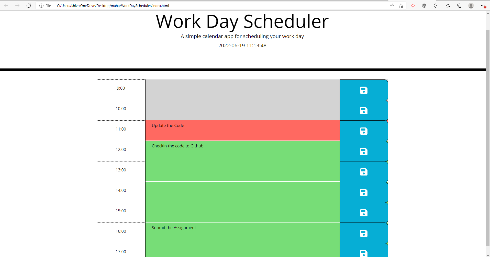

# WorkDayScheduler
## Table of contents
* [General info](#general-info)
* [Website Link](#website-link)
* [Screenshot](#screenshot)

## General info
This application is a simple calendar application that allows a user to save events for each hour of the day. This app will run in the browser and feature dynamically updated HTML and CSS powered by jQuery.
    

## Changes

* Included the Logic to show current timestamp in the header section
* Added logic to view time blocks for that day and each time block is color-coded to indicate whether it is in the past, present, or future
* Added logic to enter an event in the textarea.
* Added logic to save the event in the localstorage for the particular time block 
* Added logic to show the saved events persist when the page is refreshed

## Website Link

> Live link []

## Screenshot
The following image shows the web application's appearance and functionality:

